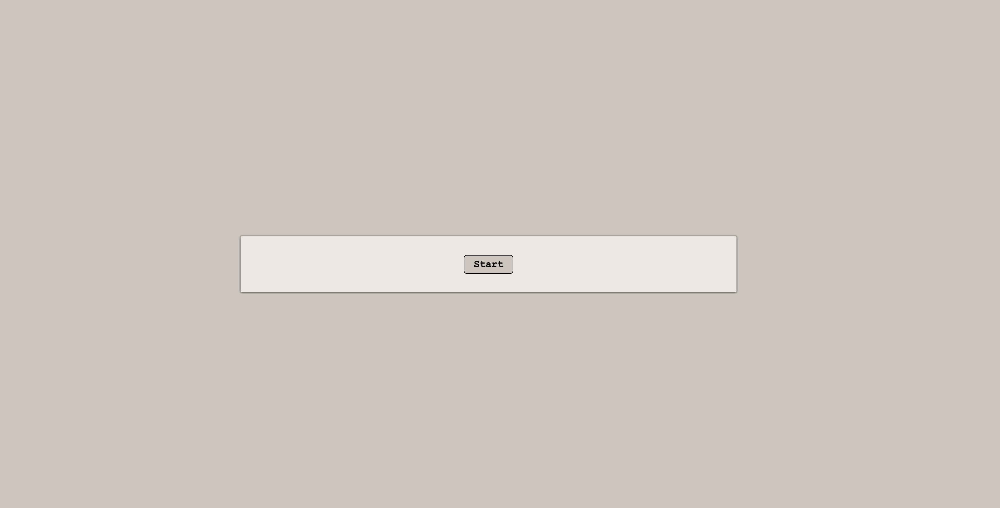
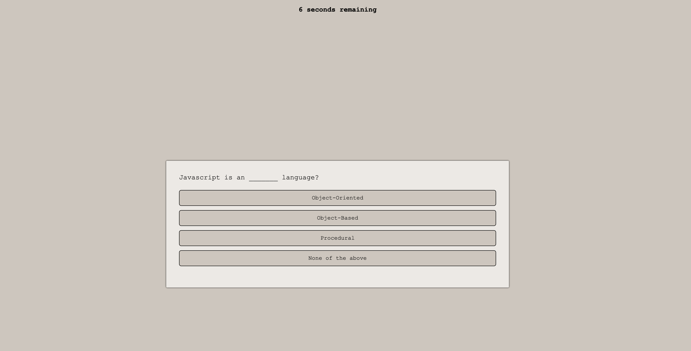
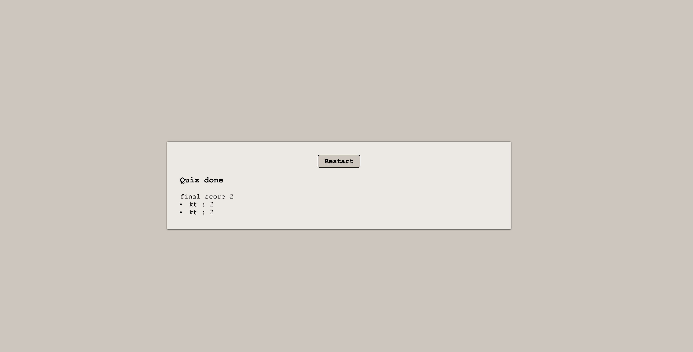

quiz gen API

This web API will be able to show rounds of questions and display choices for the user to pick, the user will be scored
on how many he or she gets right. user will be able to store the initials and score in localstorage and see the pass scores, from then they can restart the game.

shots below will show what the game will do.

